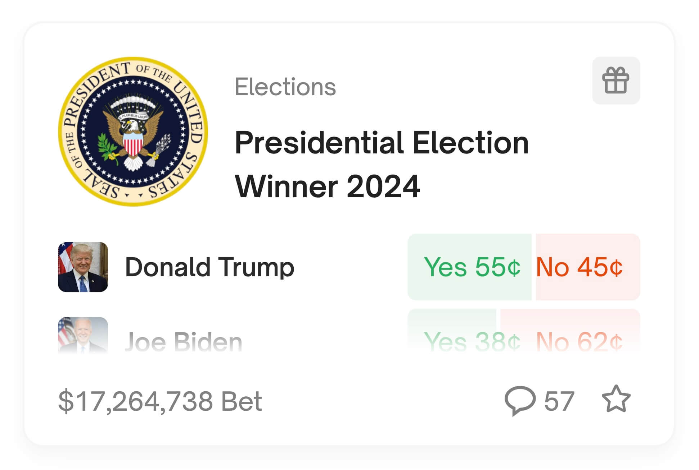
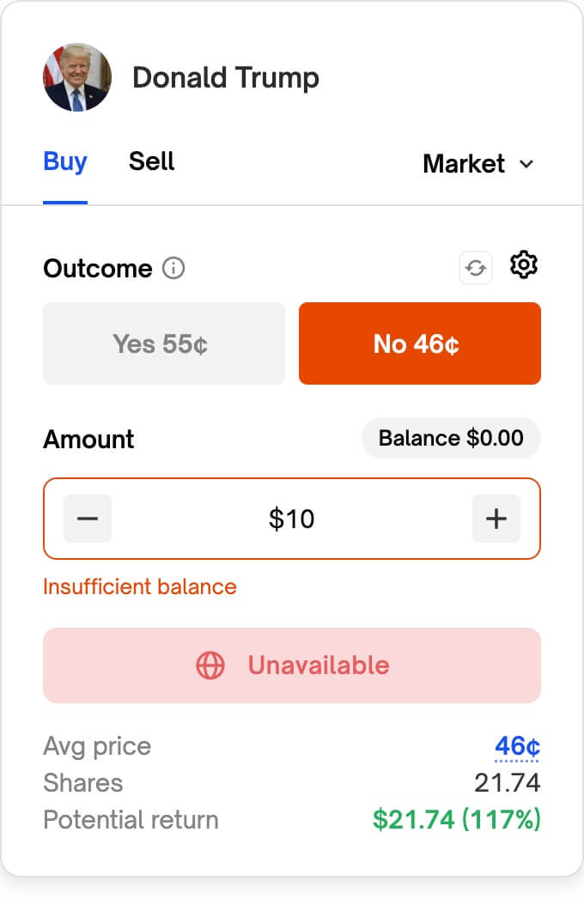
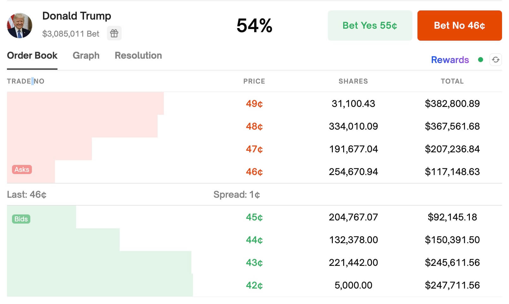

# Polymarket Attestation Open Action Module

`PolymarketAttestActionModule` is an Open Action Module for Lens Protocol that facilitates an embedded Polymarket trading experience, directly within publications.

The module serves as an attestation layer for Polymarket orders, ensuring that the Lens actor is the signer of the Polymarket order. It also provides the necessary data to display the market in the publication.

## Using the PolymarketAttestActionModule Contract

To use the live `EasPollActionModule` you can use the address and metadata below:

| Network | Chain ID | Deployed Contract                                                                                                               | Metadata                                                                     |
|---------|----------|---------------------------------------------------------------------------------------------------------------------------------|------------------------------------------------------------------------------|
| Mumbai  | 80001    | [0x077afD867F1F6144677F39416797D64d743db31D](https://mumbai.polygonscan.com/address/0x077afD867F1F6144677F39416797D64d743db31D) | [link](https://gateway.irys.xyz/0O0iruSPPJDZAWo4Ns4LW7QVmJP6RJdmILslekpTljs) | 

For instructions on how to initialize and process the Open Action Module, see the [Open Action Modules](#open-action-modules) section.

## Table of Contents

- [Polymarket Brief](#polymarket-brief)
- [Proposed User Flow](#proposed-user-flow)
- [Exchange Deployments](#exchange-deployments)
- [Polymarket.com URLs](#polymarketcom-urls)
- [Gamma Markets API (GraphQL)](#gamma-markets-api-graphql)
- [Central Limit Order Book (CLOB) API](#central-limit-order-book-clob-api)
- [Open Action Module](#open-action-module)
- [Placing Orders](#placing-orders)
  - [Proxy Wallets](#proxy-wallets)
  - [Prices and Books](#prices-and-books)
- [Allowances](#allowances)

## Polymarket Brief

Polymarket allows users to bet on the outcome of future events in a wide range of topics, like sports, politics, and pop culture. Polymarket's Order Book, also referred to as the "CLOB" (Central Limit Order Book) or "BLOB" (Binary Limit Order Book), is hybrid-decentralized wherein there is an operator that provides off-chain matching/ordering/execution services while settlement happens on-chain, non-custodially according to instructions provided by users in the form of signed order messages.



Underlying the exchange system is a custom Exchange contract that facilitates atomic swaps (settlement) between binary Outcome Tokens (both CTF ERC1155 assets and ERC20 PToken assets) and a collateral asset (ERC20) according to signed limit orders.



Orders are represented as signed typed structured data (EIP712). When orders are matched, one side is considered the maker and the other side is considered the taker. The Operator is responsible for matching, ordering, and submitting matched trades to the underlying blockchain network for execution. As such, order placement and canellation can happen immediately off-chain while only the settlement action must occur on-chain.



The docs for Polymarket can be found at https://docs.polymarket.com.

## Proposed User Flow

1. A user adds a Polymarket link while composing a Lens publication.
2. The Lens client queries the Polymarket Gamma Markets API to get the Question ID and other market data.
3. The Lens client prompts the user to embed the market in the publication, optionally showing a preview.
4. The Lens client uses the Question ID to initiate the Open Action for the publication.
5. The Lens client displays the Polymarket trading widget on publications with the Open Action attached, allowing the user to place an order on Polymarket.
6. The Lens client uses the Polymarket CLOB API to place the order.
7. The Lens client uses the PolymarketAttestActionModule to validate and attest that the actor is the signer of the Polymarket order.

## Exchange Deployments
The Polymarket Exchange contract is deployed at the following addresses:

| Network | Address                                                                                                                              |
|---------|--------------------------------------------------------------------------------------------------------------------------------------|
| Mumbai  | [0x4bFb41d5B3570DeFd03C39a9A4D8dE6Bd8B8982E](https://mumbai.polygonscan.com/address/0x4bfb41d5b3570defd03c39a9a4d8de6bd8b8982e#code) |
| Polygon | [0x4bFb41d5B3570DeFd03C39a9A4D8dE6Bd8B8982E](https://polygonscan.com/address/0x4bfb41d5b3570defd03c39a9a4d8de6bd8b8982e#code)        |

## Polymarket.com URLs

Polymarket.com URLs are in the form of

https://polymarket.com/event/presidential-election-winner-2024/will-donald-trump-win-the-2024-us-presidential-election

or

https://polymarket.com/event/presidential-election-winner-2024

or

https://polymarket.com/market/will-donald-trump-win-the-2024-us-presidential-election

Here **presidential-election-winner-2024** is the `event.slug`, while **will-donald-trump-win-the-2024-us-presidential-election** is the `market.slug`.

Events: https://docs.polymarket.com/?typescript#events

Markets: https://docs.polymarket.com/?typescript#markets


## Gamma Markets API (GraphQL)

**NOTE**: The Gamma Markets API is currently being rebuilt and has been deprecated. The new API will be available soon. In the meantime similar REST queries can be made at https://strapi-matic.poly.market.

If the user is sharing a link with only the event slug, they should be presented a list of available markets (or shown a market directly if there's only one). Example query for an event slug:

```
https://strapi-matic.poly.market/events?slug=presidential-election-winner-2024
```

returns (most fields omitted for brevity):

```json
[
  {
    "id": 903193,
    "slug": "presidential-election-winner-2024",
    "title": "Presidential Election Winner 2024",
    "description": "This is a market group on who will win the 2024 US Presidential Election (POTUS)",
    "end_date": "2024-11-05",
    "markets": [
      {
        "id": 253591,
        "question": "Will Donald Trump win the 2024 US Presidential Election?",
        "conditionId": "0xdd22472e552920b8438158ea7238bfadfa4f736aa4cee91a6b86c39ead110917",
        "questionID": "0xe3b1bc389210504ebcb9cffe4b0ed06ccac50561e0f24abb6379984cec030f00",
        "slug": "will-donald-trump-win-the-2024-us-presidential-election",
        "outcomes": [
          "Yes",
          "No"
        ],
        "outcomePrices": [
          "0.545",
          "0.455"
        ],
        "questionID": "0xe3b1bc389210504ebcb9cffe4b0ed06ccac50561e0f24abb6379984cec030f00",
        "clob_token_ids": [
          "21742633143463906290569050155826241533067272736897614950488156847949938836455",
          "48331043336612883890938759509493159234755048973500640148014422747788308965732"
        ],
        "accepting_orders": true
      }
    ]
  }
]
```

If the shared link contains a market slug, look up directly by slug:

```
https://strapi-matic.poly.market/markets?slug=will-donald-trump-win-the-2024-us-presidential-election
```

Returns something like (most fields omitted for brevity):

```json
[
  {
    "id": "253591",
    "active": true,
    "question": "Will Donald Trump win the 2024 US Presidential Election?",
    "conditionId": "0xdd22472e552920b8438158ea7238bfadfa4f736aa4cee91a6b86c39ead110917",
    "questionID": "0xe3b1bc389210504ebcb9cffe4b0ed06ccac50561e0f24abb6379984cec030f00",
    "slug": "will-donald-trump-win-the-2024-us-presidential-election",
    "clob_token_ids": [
      "21742633143463906290569050155826241533067272736897614950488156847949938836455",
      "48331043336612883890938759509493159234755048973500640148014422747788308965732"
    ]
  }
]
```

### Notes
 - The main thing we're interested in from the Gamma Markets API is the `questionID`. This is all that is needed to initiate the Open Action Module.
 - The `conditionId` is the main identifier used for Markets in the  [CLOB API](#central-limit-order-book-clob-api). 
 - The `clob_token_ids` field contains the ERC1155 Outcome Token IDs for the market. These are used to create orders.
 - The Gamma Markets API can be used without authentication, while the CLOB API requires an API key for any market-related calls.
 - The data returned from the Gamma Markets API is in a different shape than the data returned from the Polymarket CLOB API. For example, the Token IDs are returned in this form from the CLOB API:

 ```json
{
    "tokens": [
        {
            "token_id": "45192470599548595159090094230221802571282664878863077053730623624685503357046",
            "outcome": "Yes",
            "winner": false
        },
        {
            "token_id": "104708316105117381625931018009191103815070143757312220500640690567229192101989",
            "outcome": "No",
            "winner": false
        }
    ]
}
```

## Central Limit Order Book (CLOB) API

The Polymarket CLOB API plays the role of "Operator" and matches open orders. The  `@polymarkey/clob-client` library can be used to place orders, as well as query Markets and open orders.

Here's an example of how to set up the CLOB client to place orders:

```js
const host = process.env.CLOB_API_URL ?? "https://clob.polymarket.com";
const chainId = process.env.CHAIN_ID ?? 137;
const provider = new providers.Web3Provider(window.ethereum);
const signer = provider.getSigner();

// Initialize the Level 1 CLOB client
const clobClient = new ClobClient(host, chainId, signer);

// Create the required API key for the Level 2 Client (if not already created)
// This creates a wallet signing prompt
const apiKeyCreds = await clobClient.createApiKey();

// Initialize the L2 CLOB Client
const l2ClobClient = new ClobClient(clobApiUrl, chain.id, signer, apiKeyCreds);
```

### Notes   
- A "Level 1" CLOB Client is created with a wallet. It's required for making orders and creating API Keys.
- For all other CLOB API calls, a "Level 2" CLOB Client is required.
- The Level 2 CLOB Client is initialized with an API Key, which can be created by signing a message with a L1 Client.

## Open Action Module

All that's needed for initialization of the Open Action Module is the Question ID of the market being attached to the publication.

The initialization calldata ABI is:

```json
[
    {
        "type": "bytes32",
        "name": "questionId"
    }
]
```

The `initializePublicationAction` returns the `conditionId`, the ancillary question data (the actual question, itself), and the ERC1155 Binary Outcome Token IDs for the market, which are used to create orders. All of this can also be retrieved from the CLOB API.

Here's the ABI of the initialize result data:

```json
[
    {
        "type": "bytes32",
        "name": "conditionId"
    }, 
    {
        "type": "bytes",
        "name": "questionData"
    },
    {
        "type": "uint256[]",
        "name": "clobTokenIds"
    }
]
```

Clients can use this to determine the market to display as part of the publication. To validate and register an order, the process calldata ABI expects an instance of an `Order`:

```json
[
    {
        "type": "tuple(uint256,address,address,address,uint256,uint256,uint256,uint256,uint256,uint256,uint8,uint8,bytes)",
        "name": "order",
        "components": [
          { "name": "salt", "type": "uint256" },
          { "name": "maker", "type": "address" },
          { "name": "signer", "type": "address" },
          { "name": "taker", "type": "address" },
          { "name": "tokenId", "type": "uint256" },
          { "name": "makerAmount", "type": "uint256" },
          { "name": "takerAmount", "type": "uint256" },
          { "name": "expiration", "type": "uint256" },
          { "name": "nonce", "type": "uint256" },
          { "name": "feeRateBps", "type": "uint256" },
          { "name": "side", "type": "uint8" },
          { "name": "signatureType", "type": "uint8" },
          { "name": "signature", "type": "bytes" }
        ]
    }
]
```

Here's the full signed `Order` struct:

```solidity
struct Order {
    /// @notice Unique salt to ensure entropy
    uint256 salt;
    /// @notice Maker of the order, i.e the source of funds for the order
    address maker;
    /// @notice Signer of the order
    address signer;
    /// @notice Address of the order taker. The zero address is used to indicate a public order
    address taker;
    /// @notice Token Id of the CTF ERC1155 asset to be bought or sold
    /// If BUY, this is the tokenId of the asset to be bought, i.e the makerAssetId
    /// If SELL, this is the tokenId of the asset to be sold, i.e the takerAssetId
    uint256 tokenId;
    /// @notice Maker amount, i.e the maximum amount of tokens to be sold
    uint256 makerAmount;
    /// @notice Taker amount, i.e the minimum amount of tokens to be received
    uint256 takerAmount;
    /// @notice Timestamp after which the order is expired
    uint256 expiration;
    /// @notice Nonce used for onchain cancellations
    uint256 nonce;
    /// @notice Fee rate, in basis points, charged to the order maker, charged on proceeds
    uint256 feeRateBps;
    /// @notice The side of the order: BUY or SELL
    Side side;
    /// @notice Signature type used by the Order: EOA, POLY_PROXY or POLY_GNOSIS_SAFE
    SignatureType signatureType;
    /// @notice The order signature
    bytes signature;
}
```

## Placing Orders

The [@polymarket/clob-client](https://www.npmjs.com/package/@polymarket/clob-client) library can be used to query a Market by Condition ID and place an Order.

```ts
// A Level 2 CLOB Client (with API credentials) is required to query markets (which includes placing "market" orders)
const clobClient = new ClobClient(host, chain, signer, creds);

// Get the Market by Condition ID
const market = await clobClient.getMarket(conditionId);

// A "YES" Binary Outcome Token ID
const tokenID = market.tokens.find(token => token.outcome === "Yes").token_id;

// Create a market buy order (no price specified) for $15 worth of shares
const order = await clobClient.createMarketBuyOrder({
  tokenId,
  amount: 15, // 15 USDC (collateral)
  // price: 0.50 // If not specified, the best available price will be used. If no price is available, this must be specified
});

// Place the order
const resp = await clobClient.postOrder(order);
```

Note that you can also create limit orders (specify the amount of shares to buy at a specific price). If no market price is available (`clobClient.getPrice()` returns "0") then orders must be placed as a limit order with the "midpoint" price, otherwise, the order will fail. Eg:

```ts
const midRes = await clobClient.getMidpoint(tokenID);
const price = Number.parseFloat(midRes.mid);
const order = await clobClient.createOrder({
  tokenID,
  size: 100, // 100 shares
  price,
  side: Side.BUY,
})
```

You can also use the API directly to query the Market:

```
GET {clob-endpoint}/markets/{condition_id}
```

And place the order:

```
POST {clob-endpoint}/order
```

Request Payload Parameters

| Name      | Required | Type   | Description                      |
|-----------|----------|--------|----------------------------------|
| order     | yes      | Order  | signed order object              |
| owner     | yes      | string | api key of oder owner            |
| orderType | yes      | string | order type ("FOK", "GTC", "GTD") |

### Proxy Wallets

Each user has their own proxy wallet (and thus proxy wallet address) but the factories are available at the following deployed addresses on the Polygon network:

| Contract Address                                                                                                         | Factory          |
|--------------------------------------------------------------------------------------------------------------------------|------------------|
| [0xaacfeea03eb1561c4e67d661e40682bd20e3541b](https://polygonscan.com/address/0xaacfeea03eb1561c4e67d661e40682bd20e3541b) | Gnosis safe      |
| [0xaB45c5A4B0c941a2F231C04C3f49182e1A254052](https://polygonscan.com/address/0xaB45c5A4B0c941a2F231C04C3f49182e1A254052) | Polymarket proxy |

Gnosis safes are used for all MetaMask users, while Polymarket custom proxy contracts are used for all MagicLink users. Using proxy wallets allows Polymarket to provide an improved UX where multi-step transactions can be executed atomically and transactions can be relayed by relayers on the gas station network. It's not strictly required for the user to use a proxy wallet, but it's recommended.

The [@polymarket/sdk](https://www.npmjs.com/package/@polymarket/sdk) library can be used to interact with the proxy wallets. Proxy addresses are calculated using the following code:
```ts
import { getProxyWalletAddress } from "@polymarket/sdk";

const safeAddress = '0xaacfeea03eb1561c4e67d661e40682bd20e3541b';
const proxyAddress = getProxyWalletAddress(
  safeAddress, // proxy wallet factory contract
  '0x...', // address which owns the proxy wallet we want to calculate
);
```

Here's an example of creating a CLOB Client for a Gnosis Safe proxy wallet:

```ts
const [account] = await window.ethereum.request({ method: "eth_requestAccounts" });
const proxyWalletAddress = getProxyWalletAddress(safeAddress, account);
const clobClient = new ClobClient(
  host,
  chain,
  signer,
  creds,
  SignatureType.POLY_GNOSIS_SAFE,
  proxyWalletAddress,
);
```

### Prices and Books

#### Spot Price

You can get the best available price 

With the `@polymarket/clob-client` library:

```ts
const price = await clobClient.getPrice(tokenId, Side.Buy);
```

or from the CLOB API using:

```
https://clob.polymarket.com/price?token_id=[TOKEN_ID]&side=buy
```

Which returns

```json
{
    "price": "0.48"
}
```

Or the midpoint:

```ts
// Get the midpoint price for a market (halfway between best bid or best ask)
const midpoint = await clobClient.getMidpoint(tokenId);
```

and 

```
https://clob.polymarket.com/midpoint?token_id=[TOKEN_ID]
```

#### Order Book

You can also retrieve the current order book and prices for a specific market. 

With the `@polymarket/clob-client` library:

```ts
const book = await clobClient.getOrderBook(tokenId);
```

or the API:

```
https://clob.polymarket.com/book?token_id=[TOKEN_ID]
```

Which returns

```json
{
    "market": "0xdd22472e552920b8438158ea7238bfadfa4f736aa4cee91a6b86c39ead110917",
    "asset_id": "21742633143463906290569050155826241533067272736897614950488156847949938836455",
    "bids": [
        {
            "price": "0.03",
            "size": "300"
        },
        {
            "price": "0.12",
            "size": "5000"
        },
        {
            "price": "0.16",
            "size": "15000"
        },
        {
            "price": "0.17",
            "size": "3583"
        },
        {
            "price": "0.45",
            "size": "20522"
        },
        {
            "price": "0.46",
            "size": "256530.05"
        },
        {
            "price": "0.47",
            "size": "299948.42"
        },
        {
            "price": "0.48",
            "size": "158512.24"
        }
    ],
    "asks": [
        {
            "price": "0.99",
            "size": "55000"
        },
        {
            "price": "0.97",
            "size": "300"
        },
        {
            "price": "0.58",
            "size": "5000"
        },
        {
            "price": "0.55",
            "size": "5000"
        },
        {
            "price": "0.53",
            "size": "1000"
        },
        {
            "price": "0.52",
            "size": "2000"
        },
        {
            "price": "0.51",
            "size": "261145.35"
        },
        {
            "price": "0.5",
            "size": "289848"
        },
        {
            "price": "0.49",
            "size": "167976.65"
        }
    ],
    "hash": "a06bacc555bfa7386279e6b9373be56f77ac0c81"
}
```

### Allowances

If you're using an EOA wallet, instead of a proxy wallet, there are multiple approvals that need to be made. The `@polymarket/sdk` library can be used to get the CTF Exchange, ERC20 collateral token, and the ERC1155 Conditional Tokens addresses.

1. Set collateral token (USDC) allowance for ERC1155 Conditional Tokens (CTF).
2. Set USDC allowance for the Exchange.
3. Set CTF "approval for all" for the Exchange.

```ts
import { getContractConfig } from "@polymarket/clob-client";
import { polygon } from "viem/chains";

const approveSpend = async () => {
  const config = getContractConfig(polygon.id);

  const { localWalletClient } = await getWalletClient();
  try {
    let hash;
    hash = await localWalletClient.writeContract({
      address: config.collateral,
      abi: usdcAbi,
      functionName: "approve",
      args: [config.conditionalTokens, constants.MaxUint256],
    });
    console.log(`approveSpend: Setting USDC allowance for CTF: ${hash}`);

    hash = await localWalletClient.writeContract({
      address: config.collateral,
      abi: usdcAbi,
      functionName: "approve",
      args: [config.exchange, constants.MaxUint256],
    });
    console.log(`approveSpend: Setting USDC allowance for Exchange: ${hash}`);

    hash = await localWalletClient.writeContract({
      address: config.conditionalTokens,
      abi: conditionalTokenAbi,
      functionName: "setApprovalForAll",
      args: [config.exchange, true],
    });
    console.log(`approveSpend: Setting Conditional Tokens allowance for Exchange: ${hash}`);
  } catch (e) {
    console.error("approveSpend: error", e);
  }
```